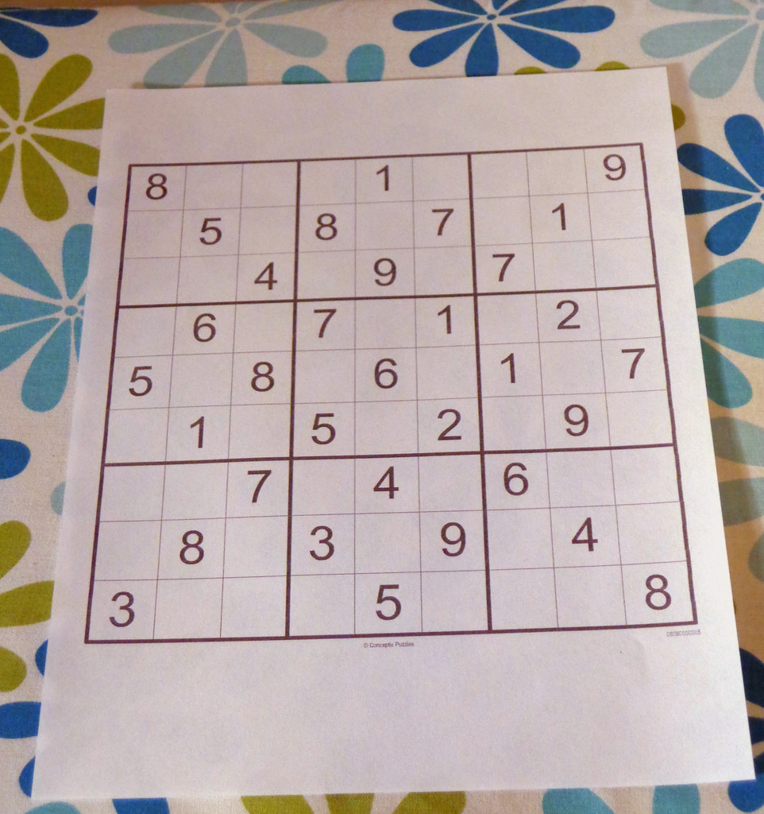
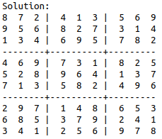
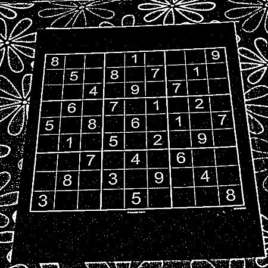
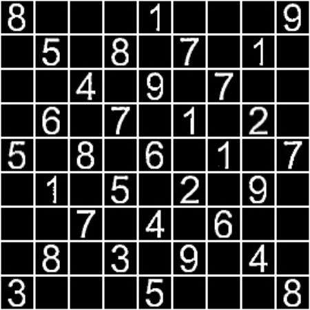
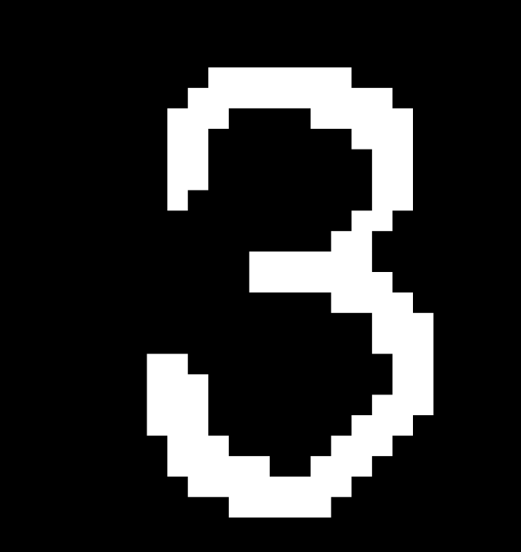
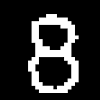
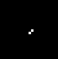
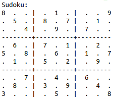

# Sudoku-Snapshot
===================

*Take a picture of a Sudoku and have Sudoku Snapshot solve it for you!*

----------
 TODO:
---------
 - [ ] Improve algorithm to get better Sudoku Grid extraction, make it `more robust against blurs` .
 - [ ] Improve `empty cell detection`. Only a basic logic is used right now.
 
Prerequisites:
-------------

- Python 2.7 but __not__ Python 3
    - Download from [here](https://www.python.org/downloads/)

- OpenCV
    - `sudo apt-get install python-opencv` (preferred)
    - Install OpenCV from [here](http://opencv.org/downloads.html) 

- Numpy (1.11.0)
    - `pip install numpy` (preferred)
    - You can build it from source [here](https://github.com/numpy/numpy)

How to use: 
----------
    git clone https://github.com/code-utk/Sudoku-Snapshot.git
    cd Sudoku-Snapshot
    python sudoku.py <path-to-input-image>
    
Working:
-------
> Here's a Sudoku image from a smartphone:

 

> The current code gives out the following output to the Terminal:

Algorithm
-------------

 > 1. Basic image preprocessing - **Thresholding**.
 > 2. Crop out approx. Sudoku puzzle (Largest contour)
 > 3. Get the grid square vertices: *(a better way of doing this is required!)*  
   3.1. Get the **largest contour** of the image. 
   3.2. Get the largest **bounding rectangle** within the contour. 
   3.3. Compute the grid corners. 
> 4. Do a **Warp perspective** on the sudoku image
> 5. We will extract cells from this, by slicing the sudoku grid evenly.
> 6. Digit isolation in cell is done through a series of steps:  
    6.1. Extract the **largest connected component** in the image, giving more *priority to the center pixels*.  
    6.2. Removing all major noise in the cell. 
> 7.  Predict Digits using a Neural Network. 

> The only 3rd party libraries required are  *OpenCV, Numpy*. The Neural Network created was trained with around 250 digits. The constants used in the training phase, the training data-set is in this repository itself. 

Here are some illustrations of the different stages:
-------

> After Preprocessing:

> Final processed Sudoku Grid

> Here are a few digits after processing the cells:

> Here's a typical empty cell:

>  Predicted Grid:

> Solved Grid:

----------
Contributors
------------------

> [Utkarsh Kumar](https://github.com/codenow-99)  
